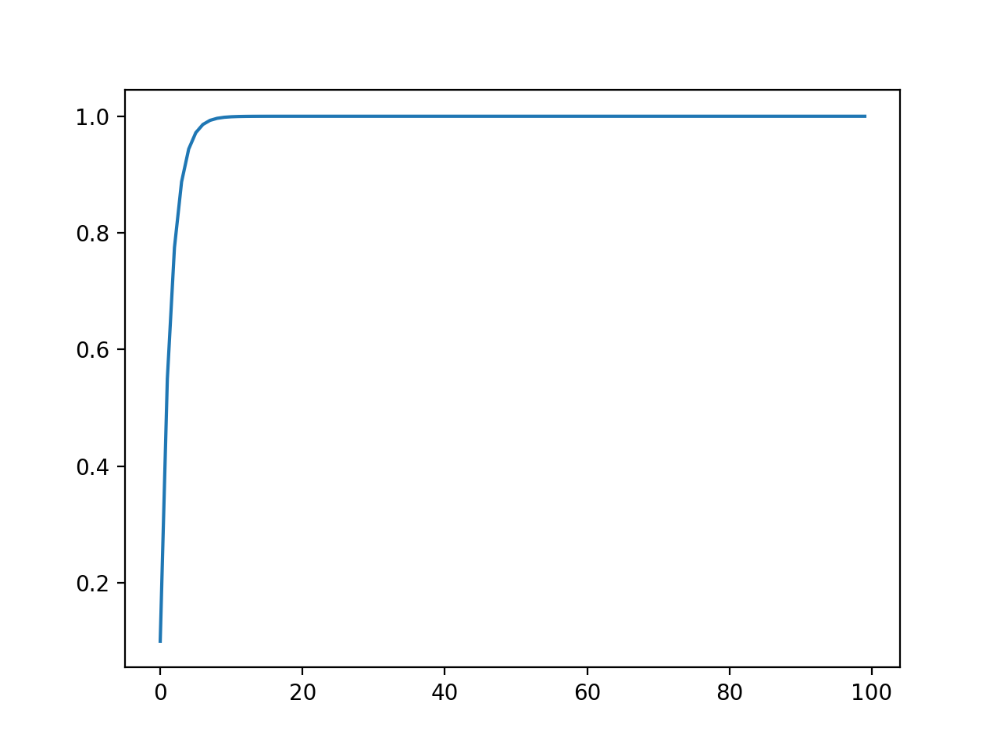
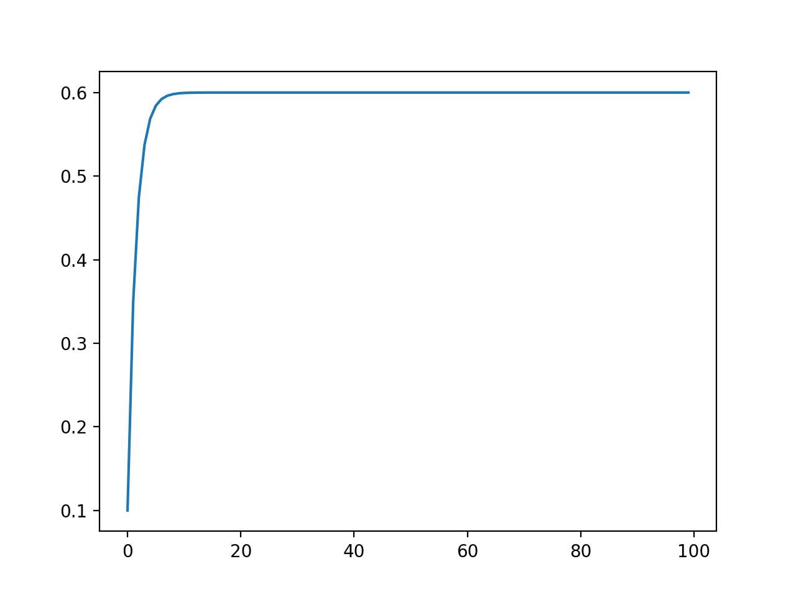
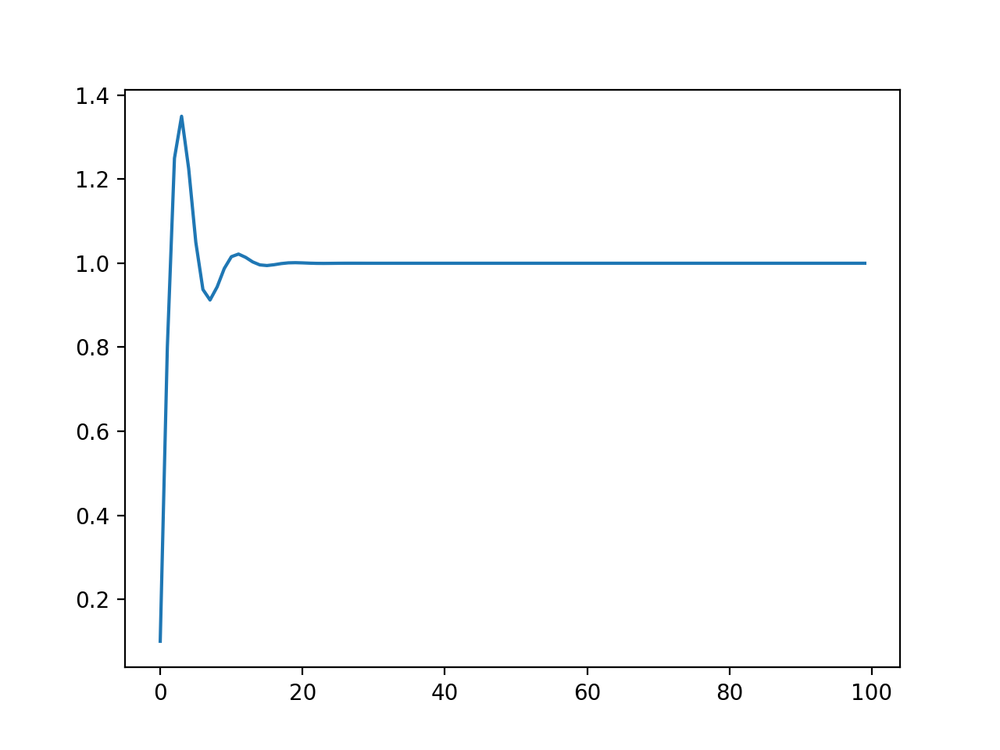
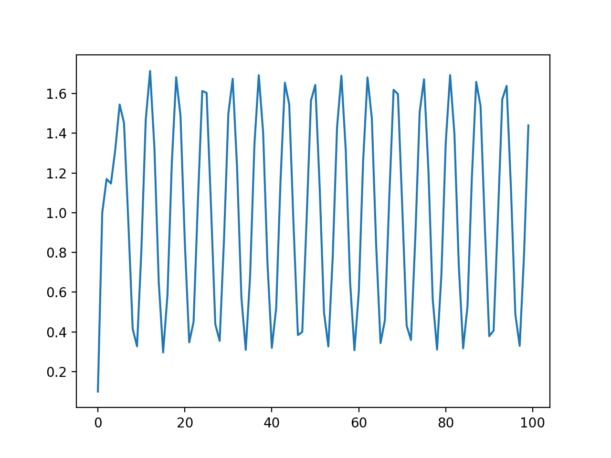
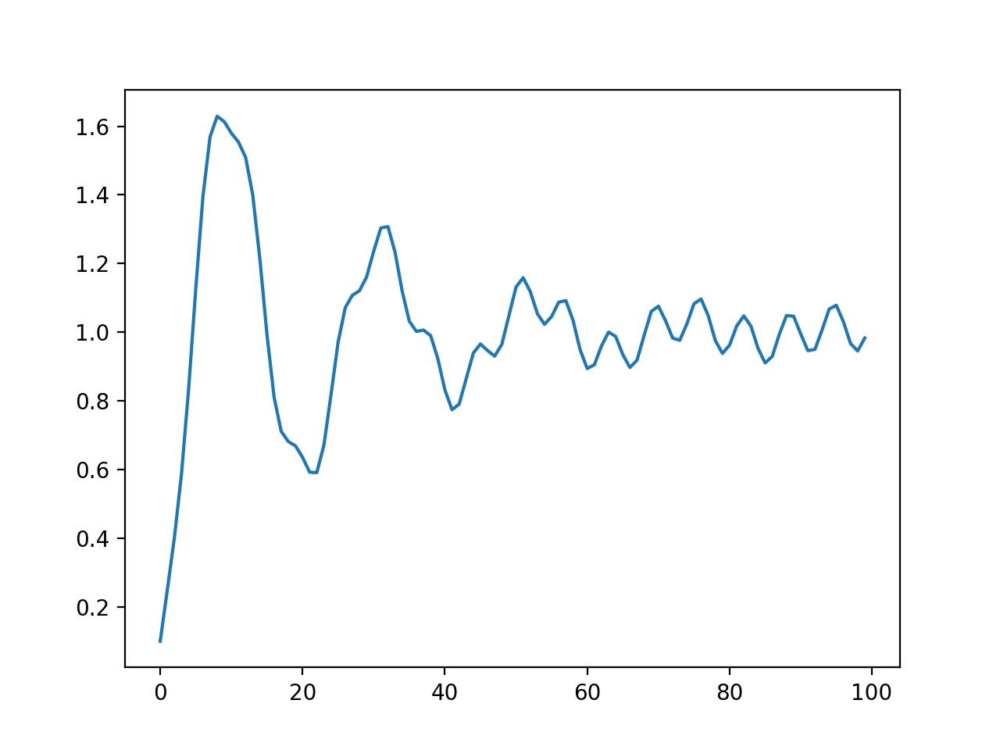

# PID Controller Demo

## P controller

Assume the target $x_d = 1.0$, the initial value $x_0 = 0.1$ and the iterative step $size = 100$.

```
pid = PID_Controller(xd = 1.0, x0 = 0.1, size = 100)
```

It can arrive the destination only by the aid of P controller.

```
pid.P_control(kp = 0.5, c = 0)
pid.plot()
```



When we add an error $c \neq 0$, the system can not achieve the goal due to a static error.

```
pid.P_control(kp = 0.5, c = 0.2)
pid.plot()
```



## PI controller

We need to empoly a integral part to eliminate the static error $c$.

```
pid.PI_control(kp = 0.5, ti = 1.0, c = 0.2)
pid.plot()
```



Now we set $c$ is not fixed number, but a function which changes with time $t$. Then the system stays in a shock state without convergence.

```
pid.PID_control(kp = 0.5, ti = 1.0, c_fun = lambda t: np.sin(t) / 3, tau = 0)
# when tau = 0, the PID controller degenerates to a PI controller.
pid.plot()
```



## PID controller

We will add a differential part to slow down the shock, howerver, it cannot be eliminated totally. 

```
pid.PID_control(kp = 0.5, ti = 1.0, c_fun = lambda t: np.sin(t) / 3, tau = 10)
pid.plot()
```


